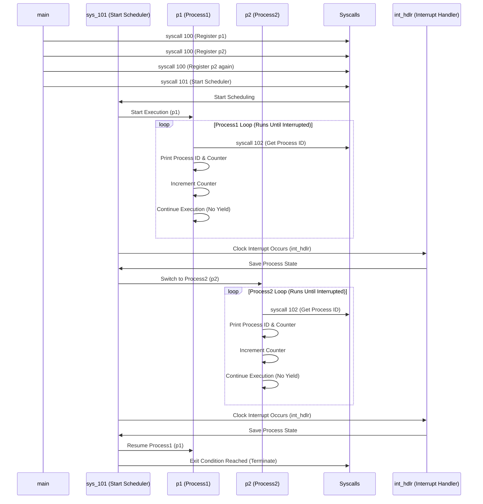

```mermaid
sequenceDiagram
    participant main
    participant sys_101 as sys_101 (Start Scheduler)
    participant p1 as p1 (Process1)
    participant p2 as p2 (Process2)
    participant syscalls as Syscalls
    participant int_hdlr as int_hdlr (Interrupt Handler)

    main->>syscalls: syscall 100 (Register p1)
    main->>syscalls: syscall 100 (Register p2)
    main->>syscalls: syscall 100 (Register p2 again)
    main->>syscalls: syscall 101 (Start Scheduler)
    
    syscalls->>sys_101: Start Scheduling
    sys_101->>p1: Start Execution (p1)
    loop Process1 Loop (Runs Until Interrupted)
        p1->>syscalls: syscall 102 (Get Process ID)
        p1->>p1: Print Process ID & Counter
        p1->>p1: Increment Counter
        p1->>p1: Continue Execution (No Yield)
    end

    sys_101->>int_hdlr: Clock Interrupt Occurs (int_hdlr)
    int_hdlr->>sys_101: Save Process State
    sys_101->>p2: Switch to Process2 (p2)
    
    loop Process2 Loop (Runs Until Interrupted)
        p2->>syscalls: syscall 102 (Get Process ID)
        p2->>p2: Print Process ID & Counter
        p2->>p2: Increment Counter
        p2->>p2: Continue Execution (No Yield)
    end
    
    sys_101->>int_hdlr: Clock Interrupt Occurs (int_hdlr)
    int_hdlr->>sys_101: Save Process State
    sys_101->>p1: Resume Process1 (p1)
    
    sys_101->>syscalls: Exit Condition Reached (Terminate)
```
